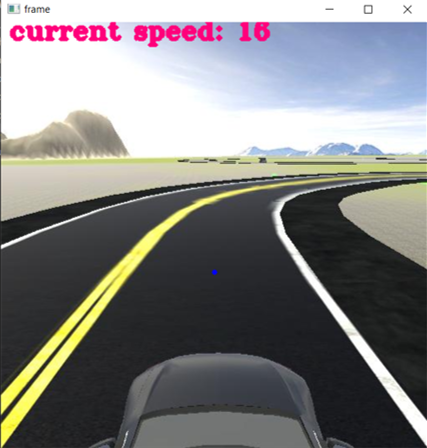
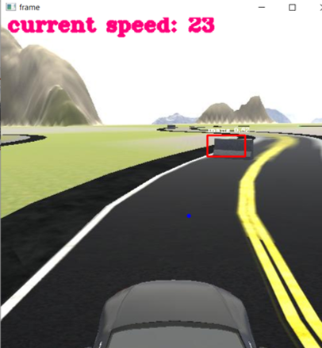
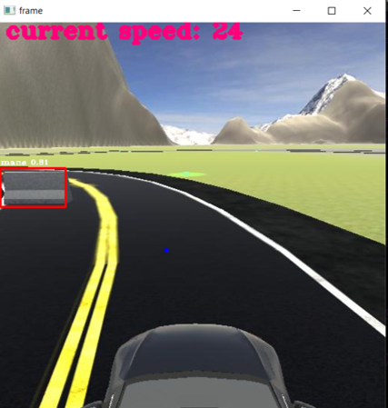

# Self-driving-car
Final Project of Machine Vision Course (Alzahra University)

# Autonomous Car Simulation with YOLOv11 and AvisEngine  

This project demonstrates a **self-driving car simulation** built on **AvisEngine**.  
The car navigates a virtual road using **lane detection** and **object detection** (YOLOv11 ONNX model).  

The system is capable of:  
- **Lane detection & steering adjustment** using computer vision.  
- **Obstacle detection (mane class)** with YOLOv11.  
- **Dynamic control of speed and steering** to avoid collisions.  
- **Visualization of detection results** (bounding boxes, labels, confidence scores).  

---

## 🚗 Features  

1. **Connection to Simulation**  
   - Uses `avisengine.Car()` to communicate with the virtual environment.  
   - Collects sensor data and real-time camera frames.  

2. **Lane Detection**  
   - Implemented with custom function `calc_steering()` (from `car_functions_v2.py`).  
   - The steering angle is computed from lane center deviation.  

3. **Obstacle Detection (YOLOv11)**  
   - Loads YOLOv11 ONNX model with `onnxruntime`.  
   - Detects objects of class **"mane"** (obstacles on the road).  
   - Bounding boxes, labels, and confidence scores are drawn on the frames.  

4. **Autonomous Driving Logic**  
   - Normal driving speed: **30 units**.  
   - If an obstacle is detected:  
     - Speed is reduced to **15 units**.  
     - Steering is changed (±45°) to avoid the obstacle.  
     - Path correction lasts **2 seconds**, after which the car returns to normal.  

---

## 🖼️ Simulation Results  

### 1. Normal Driving (No Obstacle)  
The car follows the lane at a steady speed.  
  

### 2. Obstacle Detected  
The YOLO model detects a "mane" object ahead. The car reduces speed and adjusts steering.  
  

### 3. Avoidance Maneuver  
The car steers around the obstacle and gradually returns to normal driving.  
  

---

## 🛠️ Tech Stack  

- **AvisEngine** (simulation environment)  
- **OpenCV** (image processing & visualization)  
- **YOLOv11 (ONNX model)** (object detection)  
- **ONNX Runtime** (inference engine)  
- **NumPy** (data processing)  
- **Python**  

---

## 🚀 How It Works  

1. Start **AvisEngine** simulation server (`127.0.0.1:25001`).  
2. Run the script.  
3. The car automatically:  
   - Detects lanes.  
   - Adjusts steering based on lane center.  
   - Detects obstacles with YOLO.  
   - Slows down & changes path when necessary.  
4. Visualizes results in a real-time OpenCV window.  

---
